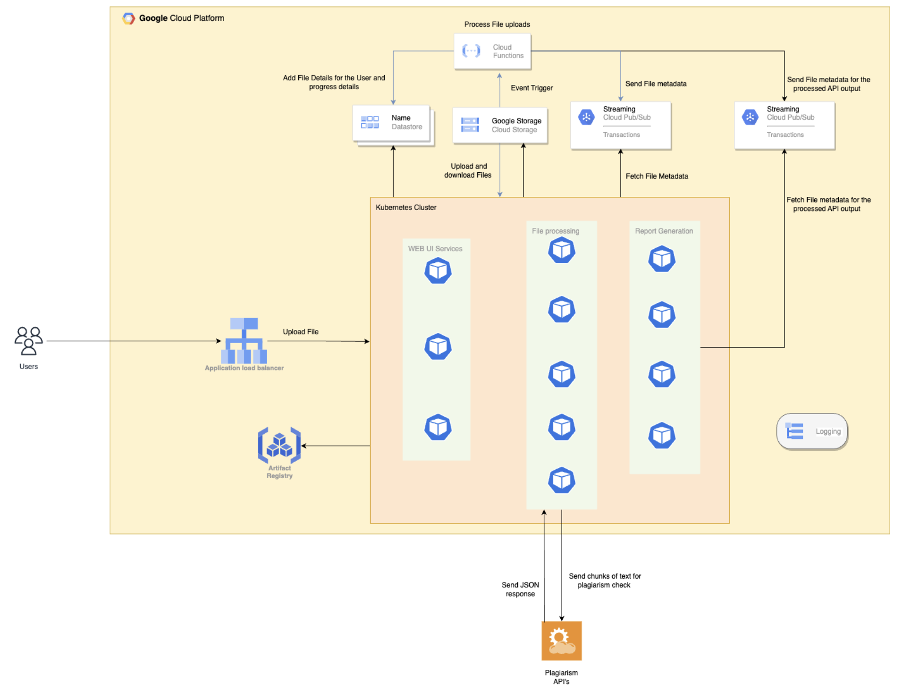

# Plagiarism Report

A highly scalable web-based system for determining whether the document's contents are plagiarized. Every user can retrieve their documents with highlighted text indicating the web source as part of the application, as well as a detailed plagiarism report.

## Architecture



## Getting Started

### Dependencies

* Python 
* Docker
* Kubernetes
* Helm 3.10.0 
* Google Cloud Platform

### Installing
Build 
```
make build 
```

deploy 
```
make infra
```

## Authors
- Niraj Gupta
- Tejas Kaushik
- Ragul VR 